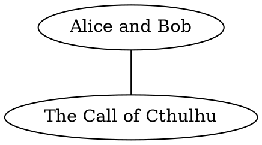

## 2021/01/09 23:48:33 六

我今天看了一个视频（BV1T5411p7ax），作者半开玩笑的发明了 English SE：

- 取消单词的复数形式：

  - I have one apple.
  - I have two apple.

- 取消第三人称单数形式：

  - He have a dog.
  - I have a dog.

- 所有的过去式和过去分词都统一为后缀 ed：

  - I have eated egg.

- 增加表示方位的介词 lo，在没有歧义的情况下代表 in/on/at。

  - I am lo the park.

我觉得太棒了。

## 2021/01/05 12:00:05 二

今天切换到了 awesome wm，参照 Arch Wiki 来安装和配置，没有什么痛苦。也参照它写好了启动脚本。

awesome-client 是个命令行工具，它可以把 Lua 代码发送给 awesome 来执行，就相当于命令行控制工具了，这个做法还真的是很整洁和干净。例如说重启 awesome，可以用：

    echo 'awesome.restart()' | awesome-client

从前我的 lxde 终端透明功能从来都没效果，今天才明白，这种功能依赖一种叫「合成管理器」的东西，大型的桌面可能会自带它，但是 lxde 就不会默认安装，更不用说 awesome 了。

我安装了一个叫 picom 的合成管理器。安装 Arch Wiki 的提示配置它，并且把 vsync 关闭（我不知道这是什么），并在上述的自动启动脚本里启动它，我的终端就能实现透明功能了。

## 2021/01/04 11:04:08 一

我的 Ubuntu 用 snap 安装的 typora 出现了奇怪的问题。今天我还是改成用 apt 的 ppa 来安装了。

## 2020/07/20 17:47:45 一

我想实现一个 `MapInto` trait，为所有可能的情况实现 `iterator.map_into()`，相当于 `iterator.map(|item| item.into())`，但是因为我的实现里 into 的结果类型不受泛型约束，所以没有成功。之后再考虑考虑怎么做。

昨天的 `&&str` 调用 `ToString` 导致迂回调用的问题，让我想起我已知的，将 `&str` 转换成 `String` 的方法有三种：

- `s.to_string()`
- `s.to_owned()`
- `s.into()`

我之前用第三种最多，因为打字少一点……现在看来，后两种都不太会产生第一种会出现的问题。

## 2020/07/19 15:06:36 日

Rust 的 `&str` 实现了 `ToString`，`str` 也实现了 `ToString`，但前者是因为下面这一串实现。

```rust
impl Display for str {}
impl<'_, T> Display for &'_ T where T: Display + ?Sized {}
impl<T> ToString for T where T: Display + ?Sized {}
```

也就是最后依赖为 str 实现的 Display::fmt 来创造字符串的。相比较而言后者的效率自然会更高。

例如 `s` 是 `&&str`，那么 `s.to_string()` 会调用 `&str` 的实现。写成 `(*s).to_string()`，调用 `str` 的实现更好一些。`cargo clippy` 可以找到第一种写法，给出一个警告。

## 2020/07/18 19:16:54 六

tmux 的默认 shell 受配置文件控制。例如要使用 fish，需要以下配置：

```
set -g default-command /usr/local/bin/fish
set -g default-shell /usr/local/bin/fish
```

注意，修改配置之后，需要关闭所有会话，新的配置才能起效。如果不在意其他会话的工作的话，可以用 tmux kill-server 杀死所有会话。

## 2020/07/18 17:54:03 六

date 工具的默认格式受 locale 影响。例如当前主要语言设置的是 C，想要输出简体中文日期时，首先编辑 `/etc/locale.gen`，打开 zh_CN.UTF-8 的开关。再运行 locale-gen 工具，最后用 LANG 环境变量控制 date。

```
env LANG=zh_CN.UTF-8 date
```

## 2020/07/17 19:54:24 五

npm 项目的 `dev-dependencies` 的依赖不会用在打包中，但会用在功能测试、示例和基准测试里。

```
[dev-dependencies]
tempdir = "0.3"
```

## 2020/07/17 17:54:14 五

```
        Vec<T>      &[T]    Box<[T]>
Vec<T>              &x[..]  x.into_boxed_slice()
&[T]    x.to_vec()          Box::new(*x)
Box<T>  x.to_vec()  &*x
```

## 2020/07/17 16:32:29 五

```rust
impl<T> Vec<T> {
    /// Shortens the vector, keeping the first len elements and dropping the
    /// rest.
    /// Note that this method has no effect on the allocated capacity of the
    /// vector.
    pub fn truncate(&mut self, len: usize)
}
```

## 2020/07/17 15:01:11 五

从 `&[u32]` 中复制最后一个元素，得到 `Option<u32>`。

```rust
fn slice_last(slice: &[u32]) -> Option<u32> {
    slice.last().copied()
}
```

用到的方法是：

```rust
impl<T> for <T> {
    pub fn last(&self) -> Option<&T>
}

impl <'_, T> Option<&'_ T> where T: Copy {
    pub fn copied(self) -> Option<T>
}
```

## 2020/05/24 23:49:08 日

### 更纱黑体

发现了一个新的字体：Sarasa Gothic / 更纱黑体 / 更紗黑體 / 更紗ゴシック / 사라사고딕 。

主页在：<https://github.com/be5invis/Sarasa-Gothic>。

清华有镜像：<https://mirrors.tuna.tsinghua.edu.cn/github-release/be5invis/Sarasa-Gothic/LatestRelease/>。
## 2020/05/23 15:24:27 六

### 退出 Vim 的 Easy Mode

`vim -y` 进入 Easy Mode，这个模式下没有办法用 ESC 进入 Normal 模式，也就没有办法用 q 命令退出 Vim。这时要用 C-L 进入 Normal 模式，然而我的 C-L 被绑定在输入 lambda 符号上了，最后只能杀死 vim 进程，然后把这个功能改到了 <leader>L 上。

但是如果这样，那 <leader> 按键就会因为要等待按键而不能及时反应，所以我又把改了之后的又删掉了。

### RD

RD 是 ruby 的 POD，比 Perl 的 POD 更好读一点。解释工具是 rd2，它是一个 gem。rd2 可以把 RD 翻译成 HTML。

### 编写 Rake 任务

Ruby 的语法在这件事情上表现的其实不错。并不比 Makefile 和 Bash 之类繁琐。

```ruby
task :publish do
  cd public_dir do
    sh 'git add .'
    sh 'git commit -m "hugo build"' do |ok, result|
      puts 'commit failed' if !ok
    end
    sh 'git push origin master' do |ok, _|
      sh 'git push -f origin master' if !ok
    end
  end
end
```

这次还找到了手动调用一个 Task 的办法：

```ruby
task :init
  init_task
end

task :reset
  rm_r public_dir if FileTest.exists! public_dir
  Rake::Task[:init].execute
end
```

### IRB

irb 有简单的任务控制，在 irb 输入 irb，就进入了新的 irb。fg n 会进入第 n 号 irb，而 jobs 函数可以看到目前的 irb 情况。

假如在 tool/x.rb 里有一些帮助函数。想要进入 irb 之前加载这个函数，只需要 `irb -Ilib -rx`。

## 2020/03/26 15:09:21 四

### Python - argparse 的子命令

```python
import argparse

def parse_cli():
    parser = argparse.ArgumentParser()

    # 用解析参数的 command 字段标识参数命令是什么
    subparsers = parser.add_subparsers(dest="command")

    # 子命令 add
    parser_add = subparsers.add_parser("add")
    parser_add.add_argument("file", nargs='+')

    # 子命令 commit
    parser_commit = subparsers.add_parser("commit")
    parser_commit.add_argument("-m", "--message")

    return parser.parse_args()
```

还可以用回调的方式：

```python
import argparse

def cli(add, commit):
    parser = argparse.ArgumentParser()

    # 用解析参数的 command 字段标识参数命令是什么
    subparsers = parser.add_subparsers(dest="command")

    # 子命令 add
    parser_add = subparsers.add_parser("add")
    parser_add.add_argument("file", nargs='+')
    parser_add.set_default(func=add)

    # 子命令 commit
    parser_commit = subparsers.add_parser("commit")
    parser_commit.add_argument("-m", "--message")
    parser_commit.set_default(func=commit)

    args = parser.parse_args()
    return args.func(args)
```

实在是啰里八嗦。

### Python - 日期格式

`time.asctime()` 可以得到一个当前日期时间的字符串表示。

### Python - 赋值表达式

```python
if (code := command()) != 0:
    return code
```

### Rust - 路径和字符串

目前 `PathBuf` 底层是 `OsString`，所以不能无消耗地转换成 `&[u8]`。

`Path` 有构造器：

```rust
pub fn new<S: AsRef<OsStr> + ?Sized>(s: &S) -> &Path
```

`String` 是 `AsRef<OsStr>`，所以 `String` 可以用来构造 `Path`。

`Path` 有下面的方法：

```rust
fn to_str(&self) -> Option<&str>;
fn to_string_lossy(&self) -> Cow<str>;
```

`to_str()` 可能失败，所以返回 `Option`。

而 `to_string_lossy()`，则不会失败，当路径不是 UTF8 的时候，会把失败的地方转换成 U+FFFD REPLACEMENT CHARACTER，这是 Unicode 的一种表示解析错误的办法。

如果发生了转换，那么返回的就是 `Cow::Owned`，而不发生转换，返回的就是 `Cow::Borrowed`。

### Emacs - 读文件

Vim 的 `:r $FILE` 命令，在 Emacs 里是 `insert-file-literally`。

```lisp
(insert-file-literally file_name)
```

## 2020/01/21 11:07:49 二

### yamllint

    pacman -S yamllint
    yamllint changelog.yml

### yq

    pacman -S yq

A jq wrapper for YAML.

## 2019/12/31 10:09:33 二

### Rust - debug 条件编译

```rust
#[cfg(debug_assertions)]
let log_level = LevelFilter::Info;

#[cfg(not(debug_assertions))]
let log_level = LevelFilter::Warn;
```

这东西老是忘。

## 2019/12/30 11:41:45 一

### supervisor

`supervizord` 读取 `/etc/supervisord.conf`，而它的最后有：

```ini
[include]
files = /etc/supervizor.d/*.ini
```

创建：`/etc/supervisor.d/hugo.ini`：

```ini
[program:hugo]
command=/usr/bin/hugo server
directory=/home/plus7wist/desktop/plus7wist-blog
user=plus7wist
redirect_stderr=true
```

启动 `supervisord`，可以选择 root 权限，没有参数。

```bash
supervisorctl help # 查看帮助
supervisorctl tail hugo # 查看 hugo 任务的输出
```

### dart 字符串和整数转换

```dart
int x = int.parse("123");
String s = 123.toString();
```

### dart - logging

```dart
import 'package:logging/logging.dart'

Logger log = new Logger('cthulhu');
Logger.root.level = Level.INFO;
Logger.root.onRecord.listen((rec) {
    print("${rec.level} ${rec.message}");
});

log.info("ps aux");
```

### dart - future

```dart
Future<R> then(
    FutureOr<R> onValue(T value),
    { Function onError }
); // 当 future 不是 error

Future<R> catchError(
    Function onError,
    { bool test(Object error) }
); // 当 future 是 error

Future<T> whenComplete(FutureOr action()); // 完成了就执行
```

`then` 的 `onValue` 返回的是 `FutureOr<R>`，可以理解为 `Future<R>` 或者 `R`。也就是返回 `R` 的话，`then` 函数会自己包装成 `Future<R>`。

```dart
static Future<List<T>> wait<T>(
    Iterable<Future<T>> futures,
    { bool eagerError: false, void cleanUp(T successValue) }
)
```

`wait` 把多个 `Future` 的列表组合成一个列表的 `Future`，适用于执行流的交汇节点。`eagerError` 参数表示是否要在出现第一个错误之后舍弃其他的 `Future`。

## 2019/12/27 11:28:47 五

Golang 的函数可以支持变长参数。

```go
func Min(min int, args ...int) int {
    for _, v := range args {
        if v < min {
            min = v
        }
    }
    return min
}

func main() {
    var values = []int{1, 2, 3, 4}
    fmt.Println(Min(10, values...))
}
```

定义的时候，`...` 加在类型前面，调用的时候，`...` 加在类型后面。

## 2019/12/26 10:25:23 四

### pacman `-Q`

```
pacman -Ql jq          # 查看 jq 包里有些什么内容
pacman -Qo /usr/bin/jq # 跟 -Ql 相反，查看一个文件是被哪个包安装上的

pacman -Qq      # 查看所有本地包
pacman -Qqe     # 查看 -Qq 里显式安装的包
pacman -Qqd     # 查看 -Qq 因为被依赖而被安装的包
pacman -Qqdt    # 查看 -Qqd 里，不再被依赖的包，一般可以删除这些包

pacman -Qqdt | pacman -Rs -

pacman -Qi jq   # 查看此包的详细信息
```

### Rust - drop 时回收对象

我有个 `IoBufferQueue`，是个线程安全的队列。它可以提供一些 `Box<[u8]>`，作为 IO 的缓冲区。在用完了缓冲区之后再把缓冲区填回队列，这样其他的线程就可以复用这个缓冲区了。为了不要在函数返回的地方忘记回收缓冲区，我就用 RAII 的方式，写了一个 `Handle`：

```rust
pub(crate) struct IoBufferHandle<'a> {
    pub buffer: Box<[u8]>,
    queue: &'a IoBufferQueue,
}
```

我的期望当然是在实现 `Drop`，然后在 `drop` 里把 `buffer` 填回 `queue` 里。但是 `drop` 的签名是：

```rust
trait Drop {
    fn drop(&mut self);
}
```

所以我没办法把对象的一部分移动走。换言之，需要保证在 `drop` 之后，对象还是完整的。这个时候就要用 `mem::replace` 了：

```rust
impl Drop for IoBufferHandle<'_> {
    fn drop(&mut self) {
        let buffer = mem::replace(self.buffer, Box::new([]));
        self.queue.recycle_buffer(buffer);
    }
}
```

## 2019/12/25 10:50:34 三

### powershell 环境变量

```powershell
# 查看环境变量
ls env:

# 输出环境变量 path 的值。Powershell 是大小写不敏感的
echo $env:path

# 查看所有变量
ls variable:

# 测试 name 变量是否存在
test-path variable:name

# 测试环境变量 name 是否存在
test-path env:name
```

### haskell - ghc

```
>>> pacman -S ghc ghc-static
>>> cat hello.hs
main = putStrLn "Hello, world"
>>> ghc --make hello.hs
[1 of 1] Compiling Main             ( hello.hs, hello.o )
Linking hello ...
>>> ls
hello  hello.hi  hello.hs  hello.o
>>> ./hello
Hello, world
```

### haskell - IO action

```haskell
ghci> :t getLine
getLine :: IO String
```

`getLine` 返回一个得到 `String` 的 IO action。用 `name <- getLine` 解开这个包，而 `name = getLine`，使得 `name` 获取了这个 IO action。

### 类型类

| Haskell   | Java      | Rust  |
|-----------|-----------|-------|
| Typeclass | Interface | Trait |

### 类型类

| Java      | Haskell   | Rust  |
| --------- | --------- | ----- |
| Interface | Typeclass | Trait |

### Haskell - return

```haskell
ghci> :t return
return :: Monad m => a -> m a
```

### Haskell - 函子举例 - IO action

```haskell
instance Functor IO where
    fmap f action = do
        result <- action
        return (f result)
```

`return x`，会得到 `x` 的 IO action。

### Haskell - 函子举例 - 半映射

`a -> b` 是一个映射的类型，这个类型也能写成 `(->) a b`，也是就说 `(->)` 是个类型构造子。

```haskell
instance Functor ((->) a) where
    fmap f g = (\x -> f (g x))
```

`fmap` 是 `(u -> v) -> f u -> f v`，将 `(->) a` 当作 `f` 代入得到 `(u -> v) -> (a -> u) -> (a -> v)`。实际上就是函数组合。

```haskell
instance Functor ((->) a) where
    fmap = (.)
```

### Haskell - 提升（lifting）

`fmap (a -> b)` 的类型是 `f a -> f b`，这里的 `f` 是一个 `Functor`。例如：

```haskell
ghci> :t fmap (*2)
fmap (*2) :: (Num a, Functor f) => f a -> f b
ghci> :t fmap (replicate 3)
fmap (replicate 3) :: (Functor f) => f a -> f [a]
```

`(*2)` 是一个函数，类型是 `a -> b`；`fmap (*2)` 是 `f a -> f b`。`fmap (*2)` 就比 `(*2)` 更高级一点，所以这个过程就叫提升（lifting）。

### Haskell - functor law - 1

```haskell
fmap id = id
```

`fmap f` 提升了 `f`，而提升成什么，是函子的实现决定的。但是它应该只是『提升』，而不是要改变函数本身的意义。所以 `fmap id`，还应该是 `id` 函数。当然我们可以说，第一个 `id` 是 `a -> a`，第二个 `id` 是 `f a -> f b`。

例如说：对 `[]` 实现了 `Functor`，它的 `fmap` 也就是 `map`，`map id` 作用到一个 `[a]` 上，显然会得到原来的列表。

### Haskell - functor law - 2

```haskell
fmap (f . g) = fmap f . fmap g
```

`f` 的提升复合 `g` 的提升，应该是 `f` 复合 `g` 的提升。

### Haskell - 函子的复合

函子的实现，决定它如何与函数复合。

- `[1,2,3]` 视作一个『输出』1、2、3 的『函数』，那么 `fmap (*3) [1, 2, 3]` 也就是在这个函数上复合 `(*3)` 这个函数，根据 `[]` 的 `fmap` 实现，这个复合方式是在对每个『输出』的数据调用 `(*3)` 这个函数。
- `Nothing :: Num a => Maybe a` 视作什么都不『输出』的函数，`fmap (+1) Nothing`，就是让这个什么都不输出的函数复合上 `(+1)` 这个函数。
- `(+1) :: Num a => a -> a` 是一个函数，`fmap (*3) (+1)` 就是两个函数的复合。

实现函子是实现广义函数复合。

### Haskell - 投喂参数

一个函数的可能是 `f :: a -> b -> c`，利用柯里化，我们可以这样调用它：

```haskell
(((f a) b) c)
```

我们这样理解这个过程，给 `f` 喂了一个函数，它就变成了还要投喂两个参数的函数。投喂了三个参数后，它就变成了一个值。

### Haskell - y 组合子

因为 Haskell 的静态类型检查，在 Haskell 里直接利用 y 组合子是不行的。

```haskell
yfact y n = if n == 0 then 1
                      else n * ((y y) $ (n-1))
fact = yfact yfact
```

需要强制打破类型检查：

```haskell
import Unsafe.Coerce
yfact y n = if n == 0 then 1
                      else n * ((y (unsafeCoerce y)) $ (n-1))
fact = yfact yfact
```

### Android Studio 和 Android SDK

```
yay -S android-studio
```

打开 IDE，它会指引下载 Android SDK。

## 2019/12/19 10:50:34 四

### Ruby - Struct

```ruby
CliConf = Struct.new(:task, :tee)
CliError = Struct.new(:error)

conf = CliConf.new(:command, false)
error = CliError.new('Empty: empty task')
```

Struct 还能跟一个代码块，可以在里面加方法。

### Ruby - `is_a?` `instance_of?`

Ruby 的对象有继承关系，例如字符串都是 `String` 类，`String` 类继承自 `Object` 类。所以，一个字符串是一个（`is_a?`）`String`，也是一个（`is_a?`） `Object`。又可以说一个字符串是 `String` 的实例（`instance_of?`），但是不是 `Object` 的实例。

还有 `kind_of?`，跟 `is_a?` 是同一个意思。

### Ruby - rubocop 和 rofo

我本來以爲 rubocop 只是個靜態檢查工具，但是今天看了看，其實也是個格式化工具。 rufo 單獨是個格式化工具，而且它的方向傾向於變成一個 opinionated（固執己見的）格式化工具，也就是說越加不能配置格式化的結果。詳情見：https://github.com/ruby-formatter/rufo/issues/2。

rubocop 有個 `-a` 選項，可以自動修改一些簡單的格式，這也是它作爲一個格式化工具的方法。

### Ruby - 切片

Ruby 數組的切片有兩種語法：`a[start..end]` 和 `a[start...end]`。區別在於前一種包括最後一個，後一種不包括。我不喜歡這種做法，因爲長得太像，實在記不住。

還有省略內容 `a[start..]`，表示從 `start` 開始到末尾。但是這種語法好像是被遺棄了，現在的做法是 `a[start..-1]`。

### Graphviz

複習一下簡單的用法：



### Ruby - 多行註釋

```ruby
=begin
註釋內容。
=end
```

### Ruby - rdoc

    pacman -S ruby-docs
    pacman -S ruby-rdoc

    ri Time

### Ruby - toml

```ruby
require 'toml'

def parse_toml(text)
    parser = TOML::Parser.new text
    parser.parsed
end

def generate_toml(data)
    generator = TOML::genrator.new data
    generator.body
end
```

### Ruby - unix 時間戳

```ruby
require 'date'

s = Time.now.to_datetime.strftime '%s'
s.to_i
```

## 2019/12/17 10:50:34 二

### Rufo

Ruby 的代码格式化工具。应该是 Ruby Formatter 的简称。

```bash
gem install rufo
rufo <file>
rufo <dir>
```

### Rubocop

Ruby 代码的风格检查工具。

```bash
gem install rubocop
rubocop
rubocop <file>
rubocop <dir>
```

### config-rs

<https://github.com/mehcode/config-rs>

Rust 配置文件解读工具。很多时候需要多层的配置结合起来，而且为不同的字段设计默认值。只用某种结构化数据格式要完成完整的配置需要还是需要很多工作的。

```rust
impl Settings {
    pub fn new() -> Result<Self, ConfigError> {
        let mut s = Config::new();

        s.merge(File::with_name("config/default"))?;
        s.merge(Environment::with_prefix("app"))?;
        s.set("database.url", "postgres://")?;
        s.try_into()
    }
}
```

### Ruby - Open3

```ruby
require 'open3'

def run_cmd(cmds)
    Open3.popen2(*cmds) { |stdin_pipe, stdout_pipe|
        //
    }
    Open3.open2e(*cmds) { |stdin_pipe, stdouterr_pipe|
        //
    }
    Open3.open3(*cmds) { |stdin_pipe, stdout_pipe, stderr_pipe|
        //
    }
end
```

### ShellCheck

```bash
pacman -S shellcheck
shellcheck <script.sh>
```

### Rake - rule

```ruby
rule '.pdf' => '.tex' do |t|
  sh "xelatex -halt-on-error #{t.source}"
end

rule '.md' => '.tex' do |t|
  sh "pandoc #{t.source} -o #{t.name}"
end
```

定义了 rule，file 任务就不必写任务动作了。

```ruby
file 'main.pdf' => 'main.tex'
file 'main.md' => 'main.tex'
```

### Rake - clean

```ruby
require 'rake/clean'

CLEAN << 'main.pdf'
```

这样可以自动生成一个 clean 任务。

### Ruby - 冻结字面字符串

```ruby
# frozen_string_literal: true

name = 'Alice'
```

冻结对象可以提高程序性能，Matz 打算在 3.0 版本把字符串默认改成冻结的。为了平稳过渡，可以用上面这行魔法字符串来打开（或者关闭）这个特性。当 Ruby 代码用了字面字符串，而且又没有这行注释，Rubocop 会给出一个警告。

### Tokei

分语言统计代码行数的工具。

```
cargo install tokei
```

